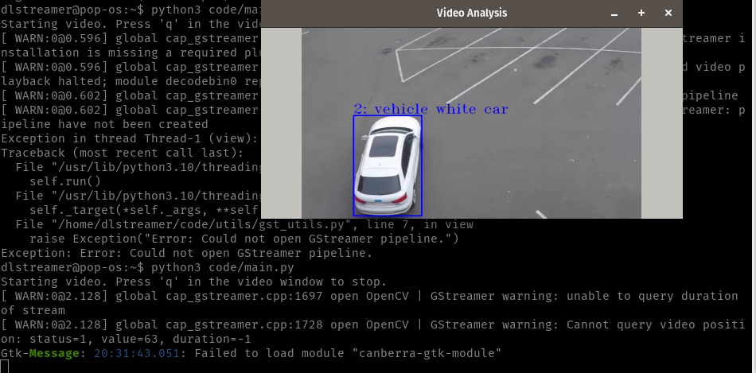
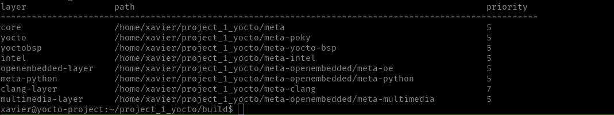

# Bitácora de Actividades

## 28 de marzo, 2025
* Se investigó el flujo de trabajo con el marco de trabajo de Intel DL Streamer y sus características.
* Se estudió como utilizar tuberias a traves de este marco de trabajo.

## 29 de marzo, 2025
* Se realizó la primera búsqueda del modelo de interés de Model Zoo.

## 31 de marzo, 2025
* Se intentó correr un primer modelo de Model Zoo y sus dependencias.

## 7 de abril, 2025
* Se estudio el repositorio del taller del dlstreamer y se utilizó el ejemplo basico de deteccion de vehiculos, personas y bicicletas y sus caracteristicas.
* Errores encontrados: el path dentro del archivo .py debe ser referente a lo interno del contenedor docker.
* Referencia: https://github.com/lumurillo/openvino-workshop-tec/blob/main/opencv_gst_example.ipynb

## 11 de abril, 2025
* El modelo se logró correr dentro de un contenedor Docker para el modelo de Vehicle and pedestrian tracking.
* Evidencia:
  ```
  docker compose run --rm dlstreamer bash
  python3 code/main.py
  ```

  

## 12 de abril, 2025

- Se cocino la imagen minima con las siguientes dependencias:
  - openvino
  - opencv
  - gstreamer
  - openssh
  - dependencias de networking
  - python3

- Es necesario agregar lo siguiente para aceptar la licencia de ciertos plugins de gstreamer:
  - LICENSE_FLAGS_ACCEPTED += "commercial"

- Layers usadas hasta ese momento:
 


## 13-14 de abril, 2025. 

- Se intentó crear una capa para dlstreamer sin exito

## 15-16 de abril 2025

- Se intentó compilar el codigo de dlstreamer dentro de la meta-layer de yocto pero no sirve
- No logro encontrar solucion a los problemas

## 17-18 de abril 2025

- Se agrego funcionalidad de cliente dhcp para obtener automaticamente la ip.
- Se intentó nuevamente crear la capa para usar Dlstreamer sin exito.

## 19 de abril 2025

- Se acomoda una version del codigo en python para que pueda reproducir un video usando Gstreamer dentro de la imagen
- Acomodo y revision del código
- Tutorial listo
- Revision de la bitacora
- Agrego listas de dependencias

## 20 de abril 2025

- Revision y ultimas correcciones del tutorial y reporte de errores

## 26 de abril 2025

- se integró exitosamente el modelo YOLO 11 dentro de la imagen

## 27 de abril 2025

- ajustes finales dentro de local conf
- preparacion y revision para la presentación