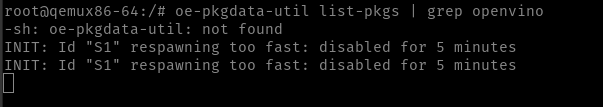
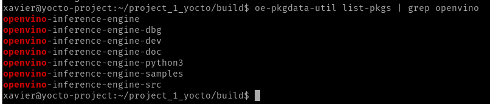
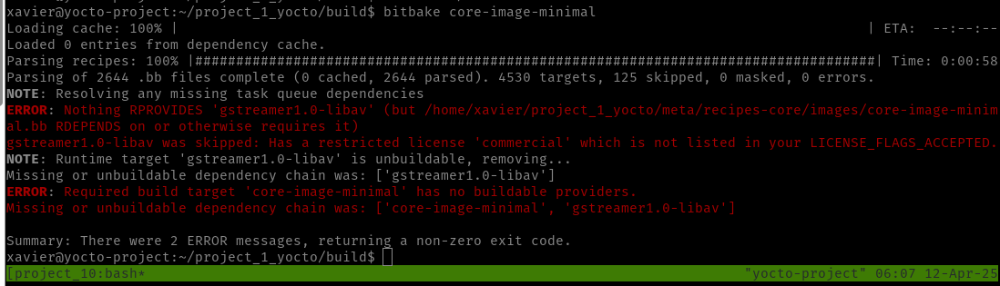
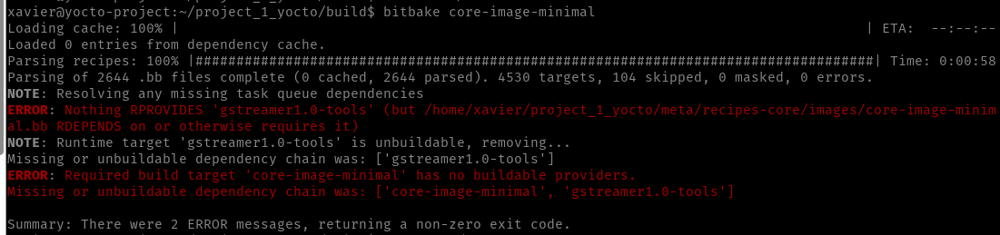

# Tutorial para crear las receta para cocinar imagen personalizada usando yocto

### Recetas:

 - Clonamos el repo de poky y usamos la version deseada con el siguiente comando:

``` git clone https://git.yoctoproject.org/git/poky && git checkout -t origin/scarthgap -b my-scarthgap```

- Clonamos los repos que contienen las capas dentro del repo de Poky:

``` git clone https://git.yoctoproject.org/meta-intel```

```git clone https://git.openembedded.org/meta-openembedded```

```git clone https://github.com/kraj/meta-clang.git```

- Ahora dentro de cada uno de los repositorios clonados hay que cambiarlos a la version de yocto que se est'a usando usamos el commando:

```git checkout -t origin/scarthgap -b my-scarthgap```

- La imagen corrio bien pero no tiene los paquetes:


- Ese error no tiene sentido porque el comando se corre en el host machine se puede observar que corre con exito


- Se agrego la capa meta-multimedia para el soporte de gstreamer pero olvide modificar el local.conf agregar lo siguiente:

# Add GStreamer support
IMAGE_INSTALL:append = " \
    gstreamer1.0 \
    gstreamer1.0-plugins-base \
    gstreamer1.0-plugins-good \
    gstreamer1.0-plugins-bad \
    gstreamer1.0-libav \
    gstreamer1.0-python \
    gstreamer1.0-rtsp-server \
"

IMAGE_INSTALL:append = " \
    gstreamer1.0-tools \
"

- Error debido al requerimiento de licencia


- Error de paquetes producido por mal nombramiento:


- Correccion eliminar lo anterior para gstreamer y añadir lo siguiente:
# GStreamer packages
IMAGE_INSTALL:append = " \
    gstreamer1.0 \
    gstreamer1.0-plugins-base \
    gstreamer1.0-plugins-good \
    gstreamer1.0-plugins-bad \
    gstreamer1.0-libav \
    gstreamer1.0-python \
    gstreamer1.0-rtsp-server \
"

# Agregando layer para Networking de openembedded

# Que pasa si se borra la carpeta donde se crea la imagen?

En este caso es necesario borrar la carpeta ```/tmp``` y volver a cocinar para evitar conflictos.
